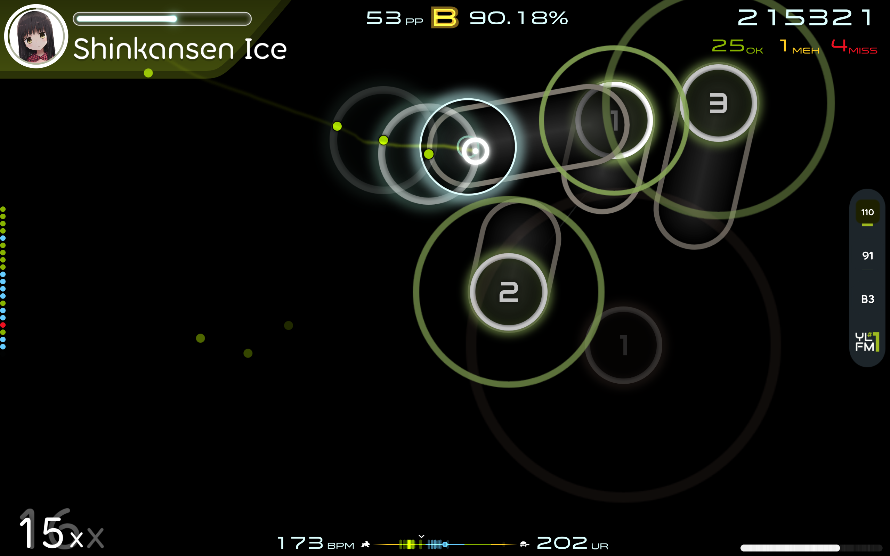

# YLFM #1 Skin
这是 osu! 比赛 YLFM #1 的主题皮肤所用到的源文件。皮肤大部分元素使用 Inkscape 制作，将`source`文件夹中的 SVG 矢量图文件用 Inkscape 导出为 PNG 格式后，用 ZIP 格式以合适的方法打包即可得到皮肤。

打击音效取自 [moonstaar](https://osu.ppy.sh/users/27339355) 的 [Moonshine 2.1](https://osu.ppy.sh/community/forums/topics/1610388?n=1)，故不在仓库中分发。

## 下载
下载请见 Releases.

## 截图

